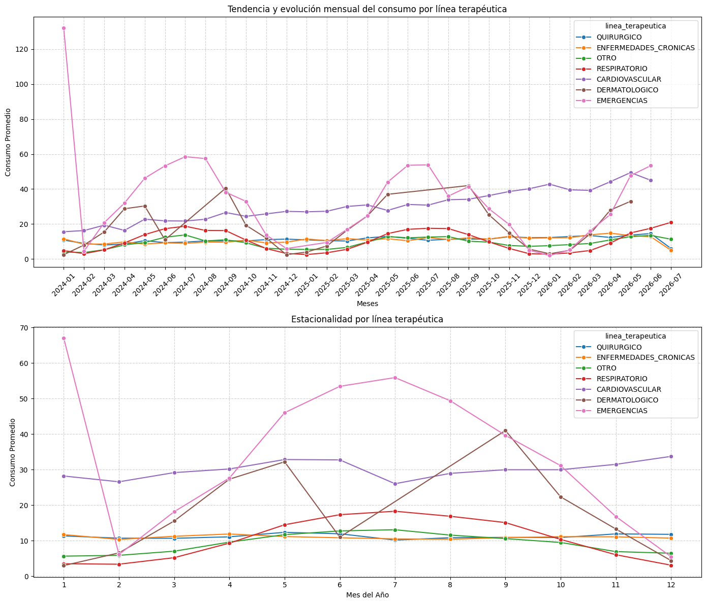
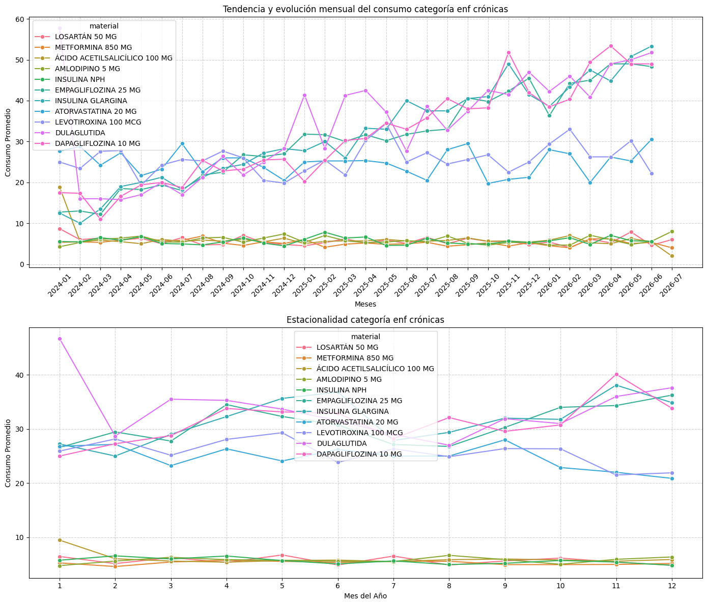
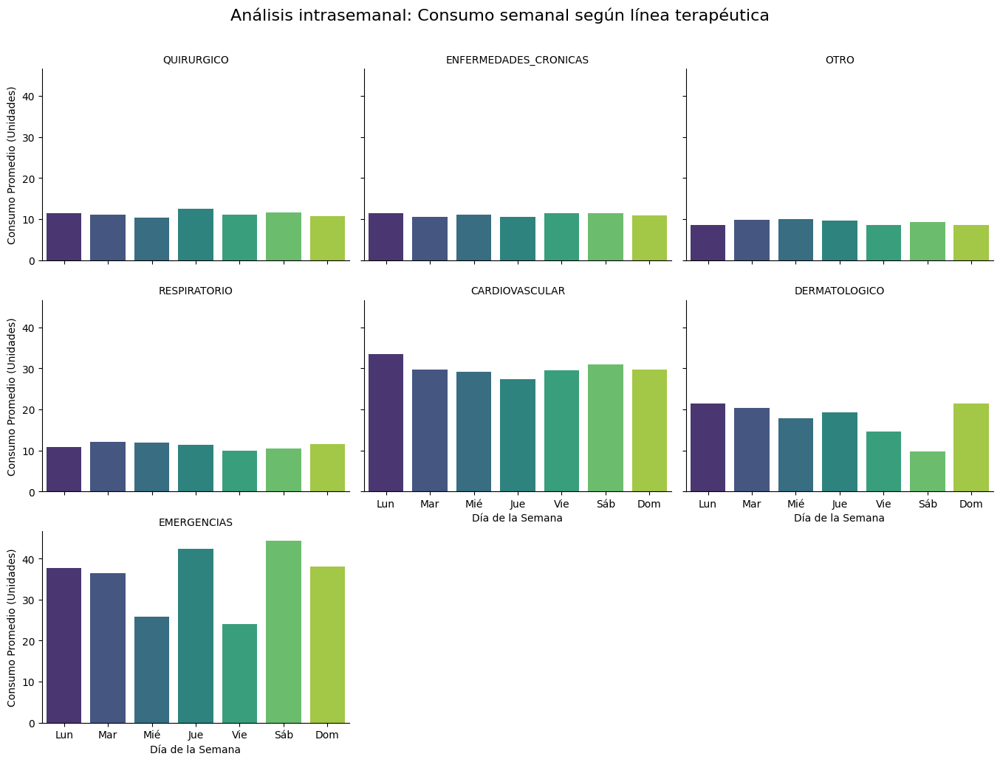

# Análisis Exploratorio de Datos (EDA)

## 1. Calidad e integridad de datos
*   Se confirmó mediante operaciones de conjuntos que los 36 códigos GTIN coinciden simétricamente en las tres fuentes de datos, asegurando un cruce limpio sin registros huérfanos.
*   El análisis de frecuencias demostró que el dataset ya se encuentra consolidado con un único registro por día para cada combinación de (GTIN + Tipo de Movimiento). La coexistencia de filas para un mismo día corresponde a flujos opuestos de entrada 'E'(reposición) y salidas 'S' (consumo).

## 2. Descriptivos y distribución del consumo
 A partir de los descriptivos de consumo, se puede concluir que existen medicamentos de alta rotación (consumo constante diario) con promedio diario alredor de 6 unidades. Mientras que otros tienen un patron diario de consumo bajo o medio pero con mayor cantidad consumida promedio. Lo anterior sugiere que existen comportamientos de consumo diferentes dentro de la muestra, resultando relevante para una posterior planificación de abastecimiento. 

 

 La gráfica de tendencia y estacionalidad por linea terapéutica arroja un claro patrón de consumo por línea. Se distingue tres agrupaciones o clusters según consumo:
 - Grupo de medicamentos de tendencia al alza sin estacionalidad (cardiovasculares)
 - Grupo de medicamentos con estacionalidad invernal (emergencias, dermatológicos y respiratorios)
 - Grupo de medicamentos con inelasticidad de consumo temporal (enfermedades crónicas y quirúrgicos)
 Sin embargo al revisar los mismos comportamientos dentro de cada línea terapéutica, los resultados son mixtos, es decir que el comportamiento de consumo no depende de la linea terapéutica. A modo de ejemplo se muestran la linea de enfermedades cronicas. Donde se observa que tres medicamentos presentan una tendencia positiva, mientras que el resto se presenta invariante en el tiempo. 
 
 

En cuanto a efecto intrasemanal o efecto dia de semana existiría una regularidad de consumo promedio intrasemanal para casi todas las lineas terapéuticas, es decir que no existirían shocks de consumo para estos datos, a diferencia de una farmacia donde el mayor consumo podría situarse los fines de semana. Sin embargo, a nivel individual si podrian existir patrones como el caso de medicamento dermatológico, que tiene una caída los dias sábados. 

El Analisis exploratorio, indica que existen claros clusters de consumo con respecto a los medicamentos, por lo que el modelo de ajuste debe contemplar las tres variantes tendencia alcista, estacionalidad invernal e invariabilidad temporal de manera de mejorar las métricas de desempeño y la precisión de las predicciones.

# Modelamiento 

## 1. Selección del Algoritmo
Se seleccionó un `RandomForestRegressor`. Esta decisión se fundamenta en los hallazgos del EDA: 
* Al existir una demanda inelástica pero con tendencias crecientes a largo plazo (Cardiovascular) y picos invernales (Respiratorio), este modelo aísla de forma óptima las interacciones de variables categóricas sin necesidad de transformaciones de estacionariedad econométrica clásica.

## 2. Preprocesamiento e ingeniería de características (Features)
La matriz de diseño se construyó a partir de variables de orden temporal:
* Se utilizó componentes armónicos (`mes_sin`, `mes_cos`) para encapsular la estacionalidad del consumo.
* Una variable de conteo lineal continuo (`tendencia_dias`) para guiar la proyección frente al crecimiento interanual.
* Dos variables de categorías operativas (línea terapéutica  y uso) reemplazando por la media histórica de su demanda mediante target encoding, agrupando los registros nuevos o faltantes bajo la etiqueta 'OTRO'.
* También se incluyo variable de `dia_semana` para abordar variaciones en consumo según dia de la semana. 